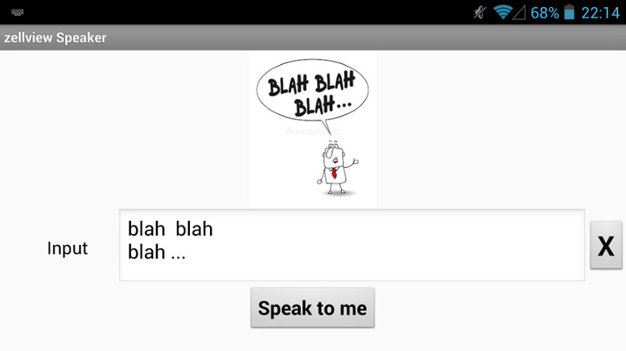

## zellview Speaker

is a simple android-app written in Blockly for **[AppInventor2](http://ai2.appinventor.mit.edu)** 
showing the use of textToSpeech and image components.

You will need this **[companion app](https://play.google.com/store/apps/details?id=edu.mit.appinventor.aicompanion3&hl=de)** on your android-phone.

enjoy and happy coding

